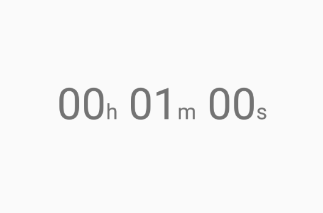

# CountDownView
A simple view that does a temporal count down.

<center></center>

# Installation
Pull in CountDownView from Jitpack...

```
allprojects {
	repositories {
		maven { url 'https://jitpack.io' }
	}
}

dependencies {
  implementation 'com.github.alexfu:CountDownView:0.1.0'
}
```

# Usage
Include in your layout...

```
<com.alexfu.countdownview.CountDownView
    android:id="@+id/count_down"
    android:layout_width="wrap_content"
    android:layout_height="wrap_content"
    android:textAppearance="@style/TextAppearance.AppCompat.Display1"
    app:startDuration="60000"/>
```

Then, in your Activity/Fragment, obtain the view and call `start()`.

```
CountDownView countDownView = findViewById(R.id.count_down);
countDownView.start();
```
